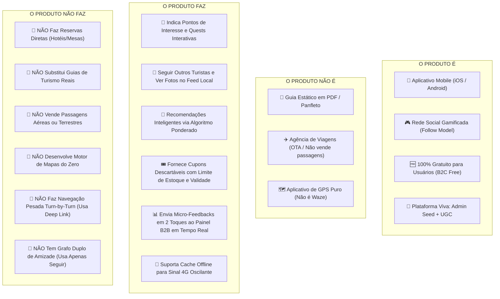
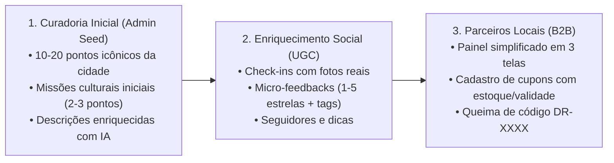

# PRD: De Rota

> **Conceito de Marca:** Inspirado na expressão popular *"De rocha"* (autenticidade, confiança e firmeza), o **De Rota** conecta viajantes aos melhores pontos da cidade com missões interativas, cupons e experiências reais.

---

## 0. Document Purpose

Este Documento de Requisitos de Produto (PRD) formaliza a especificação oficial do **De Rota** para a conclusão da **Fase 1 (Planejamento e Requisitos)** no âmbito da disciplina **Projetos Aplicados II**. Ele consolida a visão estratégica da Lean Inception, a matriz **É / NÃO É / FAZ / NÃO FAZ**, o modelo de alimentação de dados (Curadoria Inicial do Administrador + Enriquecimento Colaborativo UGC) e o escopo enxuto calibrado para entrega garantida dentro do semestre.

---

## 1. Visão do Produto e Matriz Estratégica

### 1.1 Declaração de Visão (Lean Inception)
* **Para:** Turistas em busca de experiências autênticas e dinâmicas, e comerciantes/empresas do setor de turismo local.
* **Cujo Problema:** A falta de engajamento em roteiros engessados, experiências turísticas genéricas e a demora do comércio local em conectar-se com o visitante no destino.
* **O De Rota:** É um **aplicativo mobile de rede social gamificada**, **100% gratuito para os viajantes**.
* **Que:** Guia a exploração urbana e cultural através da **indicação inteligente de pontos de interesse e missões interativas (Quests)** com check-in geolocalizado, pontos XP, insígnias (*badges*) e cupons promocionais descartáveis no comércio local.
* **Diferente de:** Guias turísticos estáticos em PDF, panfletos impressos, agências de viagem (OTAs) ou apps de mapa/GPS puro (como Google Maps ou TripAdvisor tradicional).
* **O Nosso Produto:** É **inicialmente alimentado por curadoria do administrador** e **enriquecido organicamente pelas avaliações e fotos dos próprios turistas (UGC)**, conectando viajantes via feed social e entregando aos empresários um **painel web simples com 3 telas para recebimento de micro-feedbacks em 2 toques e queima anti-fraude de cupons**.

---

### 1.2 Matriz Estratégica: É – NÃO É – FAZ – NÃO FAZ

---

## 2. Ciclo de Vida e Alimentação dos Dados (Bootstrapping)

1. **Fase 1 — Curadoria Inicial (Admin Seed):** O administrador cadastra os primeiros Pontos de Interesse (POIs) e Quests temáticas oficiais de 2 a 3 pontos.
2. **Fase 2 — Enriquecimento Colaborativo (*UGC*):** Os turistas alimentam a rede adicionando fotos reais de check-in, avaliações, comentários e micro-feedbacks.
3. **Fase 3 — Gestão Autônoma de Parceiros (B2B):** Comerciantes locais gerenciam seus cupons e monitoram o sentimento do público pelo painel web enxuto.

---

## 3. Usuários-Alvo e Contexto de Mercado

### 3.1 Jobs To Be Done (JTBD)

#### Segmento B2C — Turistas e Viajantes (Gratuito):
- **Funcional:** Descobrir pontos turísticos e culturais autênticos rapidamente via onboarding relâmpago (< 10 segundos).
- **Social:** Seguir outros viajantes na cidade em tempo real, visualizando fotos de check-in recentes e trocando dicas no feed.
- **Emocional:** Sentir a satisfação de explorar a cidade livremente, colecionando insígnias e economizando no comércio local com cupons reais.

#### Segmento B2B — Empresários e Comércio Local:
- **Funcional:** Cadastrar cupons promocionais com controle de quantidade máxima (estoque) e dias/horários de validade para atrair público em horários ociosos.
- **Inteligência Ágil:** Receber micro-feedbacks em 2 toques no painel para acompanhar a satisfação dos clientes instantaneamente.
- **Segurança Anti-Fraude:** Queimar códigos descartáveis de uso único (`DR-XXXX`) em menos de 3 segundos.

### 3.2 Principais Jornadas de Usuário (User Journeys)

#### UJ-1: Sofia faz onboarding relâmpago, cumpre Quest e resgata cupom
- **Persona & Contexto:** Sofia, 24 anos, turista independente explorando um centro histórico.
- **Estado de Entrada:** App mobile **De Rota** instalado.
- **Fluxo:**
  1. **Onboarding Relâmpago (7 segundos):** Sofia seleciona *"Gastronomia"* e *"História"* em uma grade de 6 ícones e cai direto no mapa.
  2. Recebe a sugestão da missão *"Circuito do Café Histórico"* (composta por 2 paradas a pé).
  3. Sofia caminha até a primeira estátua histórica a 100m. Mesmo com 4G oscilante, o **cache local** valida o check-in por GPS (raio de 50m) e permite anexar uma foto.
  4. Conclui a segunda parada e desbloqueia a insígnia *"Exploradora do Café"* + 100 XP.
  5. O app libera um cupom de 15% em uma cafeteria histórica a 50m.
  6. Sofia clica em *"Resgatar Cupom"*; o app gera o token de uso único `DR-8429` (válido por 15 minutos).
  7. O atendente da cafeteria digita `DR-8429` no painel web do lojista e clica em "Validar", queimando o cupom atomicamente.
  8. Ao finalizar a compra, Sofia responde ao **Micro-Feedback em 2 toques**: dá 5 estrelas, clica na tag *"Atendimento Ágil"* e escreve *"Café excelente!"*.
- **Clímax:** A avaliação apita instantaneamente no painel do dono da cafeteria e Sofia ganha 20 XP extras.

#### UJ-2: Pedro segue viajantes na cidade e troca dicas
- **Persona & Contexto:** Pedro, mochileiro solo que busca inspiração no destino.
- **Estado de Entrada:** Usuário ativo no feed social do De Rota.
- **Fluxo:**
  1. Pedro abre a aba social e visualiza fotos de check-in recentes postadas por viajantes nos pontos ao redor.
  2. Clica em **"Seguir"** no perfil da Sofia (modelo unilateral direto, sem burocracia de solicitação).
  3. Curte a foto dela na cafeteria e comenta pedindo dica do melhor café.
  4. Sofia responde ao comentário; Pedro clica no botão *"Como Chegar"* do card da cafeteria e o app abre o Google Maps para ele caminhar até lá.
- **Clímax:** Conexão social comunitária ágil sem necessidade de chat privado.

#### UJ-3: Empresário opera seu painel web em 3 telas
- **Persona & Contexto:** Carlos, proprietário de um bistrô parceiro cadastrado.
- **Estado de Entrada:** Carlos acessa o Painel Web do Lojista.
- **Fluxo:**
  1. **Tela 1 (Queima de Cupom):** Digita o código apresentado pelo turista e clica em "Validar".
  2. **Tela 2 (Gestão de Cupons):** Cadastra a promoção: *"20% de desconto no almoço - Limite: 30 resgates - Válido de Terça a Quinta das 12h às 15h"*.
  3. **Tela 3 (Feed de Opiniões):** Visualiza as últimas avaliações em 2 toques e a média de estrelas recebidas.
- **Clímax:** Operação simples e sem curva de aprendizado, pronta para uso no caixa.

---

## 4. Glossário

- **De Rota:** Nome oficial do aplicativo mobile de rede social gamificada e turismo inteligente.
- **Ponto de Interesse (POI):** Local físico cadastrado com coordenadas GPS, fotos e categorias.
- **Missão Interativa (Quest):** Roteiro curto e enxuto composto por 2 a 3 pontos de interesse temáticos.
- **Modelo Seguir (Follow Graph):** Relacionamento social unilateral onde o usuário segue perfis públicos para ver atualizações no feed.
- **Curadoria do Administrador (Admin Seed):** Cadastro inicial dos primeiros 10 a 20 pontos e missões feito pela equipe do projeto.
- **Conteúdo Colaborativo (UGC):** Fotos, avaliações e dicas geradas pelos turistas durante os check-ins.
- **Recomendação Inteligente:** Algoritmo determinístico ponderado: $\text{Score} = (\text{Afinidade} \times 0.4) + (\text{Proximidade} \times 0.4) + (\text{Popularidade} \times 0.2)$.
- **Micro-Feedback em 2 Toques:** Avaliação rápida (1-5 estrelas + tags pré-definidas + texto curto) com alerta em tempo real para o comerciante.
- **Cupom Descartável (Token `DR-XXXX`):** Código dinâmico alfanumérico de uso único com expiração de 15 minutos e regras de estoque/horário definidas pelo lojista.
- **Cache Local de Missão:** Armazenamento temporário no dispositivo para permitir check-in mesmo com 4G oscilante.

---

## 5. Funcionalidades e Requisitos Funcionais (FRs)

### 5.1 Módulo 1: Onboarding Relâmpago e Algoritmo de Sugestão
**Descrição:** Entrada rápida do usuário e motor de recomendação inteligente. Realiza UJ-1.

#### FR-1: Onboarding Relâmpago de Interesses
O sistema deve apresentar uma grade visual de 6 categorias (Gastronomia, História, Natureza, Cultura, Aventura, Vida Noturna) no primeiro acesso, permitindo seleção múltipla em menos de 10 segundos. Realiza UJ-1.
- **Critérios de Aceite:**
  - Persistência obrigatória de pelo menos 1 categoria.
  - Redirecionamento instantâneo para o mapa/feed sem formulários adicionais obrigatórios.

#### FR-2: Algoritmo de Recomendação Ponderado e Explicável
O sistema deve ranquear pontos e missões através da fórmula explicável:
$$\text{Score} = (\text{Afinidade} \times 0.4) + (\text{Proximidade} \times 0.4) + (\text{Popularidade} \times 0.2)$$
- **Critérios de Aceite:**
  - Exibição de metadados justificando a sugestão (ex.: *"Porque você está a 150m e curte Gastronomia"*).

#### FR-3: Curadoria Inicial do Administrador (Admin Seed)
O sistema deve fornecer interface web administrativa para cadastro dos 10 a 20 pontos de interesse iniciais da cidade com apoio de IA para enriquecimento descritivo. Realiza UJ-1.

---

### 5.2 Módulo 2: Gamificação, Check-in e Resiliência Offline
**Descrição:** Mecânicas lúdicas de exploração e validação de presença. Realiza UJ-1.

#### FR-4: Validação de Check-in por GPS com Cache Local e Deep Link
O turista valida o check-in ao chegar nas coordenadas do ponto de interesse. Realiza UJ-1.
- **Critérios de Aceite:**
  - Validação por GPS dentro do raio de 30 a 100m.
  - Suporte a **cache local** dos dados da missão para permitir validação em caso de 4G oscilante, sincronizando os pontos assim que a conexão restabelecer.
  - Opção de contingência por leitura de QR Code físico no local.
  - Botão *"Como Chegar"* que abre o Google Maps ou Apple Maps nativo via deep link.

#### FR-5: Gestão de Pontos XP e Insígnias
Ao concluir paradas e missões, o sistema credita pontos XP e concede insígnias de forma atômica no perfil do viajante. Realiza UJ-1.

---

### 5.3 Módulo 3: Grafo Social Unilateral (Seguir) e Feed Comunitário
**Descrição:** Camada social enxuta e eficiente. Realiza UJ-2.

#### FR-6: Sistema de Seguir (Follow Model) e Feed de Check-ins
O usuário pode seguir outros viajantes de forma unilateral e visualizar suas fotos e relatos no feed local. Realiza UJ-2.
- **Critérios de Aceite:**
  - Ação de seguir imediata (sem pendência de aprovação).
  - Feed com fotos (até 5MB) de check-ins e comentários públicos.

#### FR-7: Bloqueio Bidirecional de Segurança
O usuário pode bloquear outros perfis a qualquer momento, cessando imediatamente a visualização de postagens e interações. Realiza UJ-2.

---

### 5.4 Módulo 4: Painel B2B do Empresário (3 Telas Enxutas) e Cupons Anti-Fraude
**Descrição:** Interface simplificada para lojistas operarem cupons e receberem feedbacks instantâneos. Realiza UJ-1, UJ-3.

#### FR-8: Emissão e Queima Anti-Fraude de Cupons Descartáveis
O turista resgata cupons gerando um token dinâmico `DR-XXXX` de uso único com 15 minutos de validade. Realiza UJ-1, UJ-3.
- **Critérios de Aceite:**
  - O lojista digita o código no painel para queimar o cupom; a validação é atômica no banco de dados, impedindo qualquer reutilização.

#### FR-9: Governança de Cupons (Estoque e Janela de Validade)
O lojista pode cadastrar cupons definindo quantidade máxima de utilizações (estoque) e dias/horários de validade. Realiza UJ-3.
- **Critérios de Aceite:**
  - O cupom é desativado automaticamente ao atingir o limite de estoque ou ultrapassar o horário permitido.

#### FR-10: Micro-Feedback em 2 Toques e Feed de Opiniões
Ao resgatar o cupom ou fazer check-in, o turista avalia o local em 2 toques (1-5 estrelas + tags rápidas + texto curto opcional). Realiza UJ-1, UJ-3.
- **Critérios de Aceite:**
  - Alerta instantâneo exibido no feed de opiniões do painel do comerciante.

---

### 5.5 Módulo 5: Validação do Piloto Acadêmico (PA2)
**Descrição:** Módulo nativo para coleta empírica de resultados da disciplina. Realiza UJ-4.

#### FR-11: Módulo Nativo de Validação e Telemetria
O sistema deve disponibilizar questionário in-app para avaliação de satisfação geral (CSAT) e assertividade do piloto. Realiza UJ-4.

---

## 6. Não-Objetivos Explícitos (Limites de Segurança / Anti-Alucinação)

1. **NÃO fazer reservas diretas de hotéis, mesas ou pousadas:** O app entrega o cupom; o pagamento/atendimento é feito no balcão.
2. **NÃO substituir Guias de Turismo Reais:** O app é um facilitador de auto-guiamento autônomo.
3. **NÃO vender passagens aéreas ou rodoviárias:** O De Rota não opera como agência OTA.
4. **NÃO desenvolver motor próprio de mapas ou navegação curva a curva:** Consumo de APIs consolidadas e uso de deep links para navegação externa.
5. **NÃO implementar grafo duplo de amizade:** Utilização exclusiva do modelo unilateral de "Seguir".
6. **NÃO implementar Realidade Aumentada (AR) pesada nem vídeo ao vivo.**

---

## 7. Escopo do MVP (Fase 1 / Semestral)

### 7.1 No Escopo (In-Scope v1)
- Aplicativo Mobile responsivo gratuito para turistas (**De Rota**).
- Onboarding relâmpago de interesses (< 10 segundos).
- Painel Web enxuto para empresários locais (3 telas: Queima, Gestão com Estoque/Validade e Feed de Opiniões).
- Curadoria inicial de 10 a 20 pontos pelo Administrador (Admin Seed) + Enriquecimento por avaliações dos usuários (UGC).
- Algoritmo de Recomendação Inteligente ponderado (Afinidade + Proximidade + Popularidade).
- Motor de Gamificação com Check-in por GPS/QR Code, Cache Local para resiliência offline, Pontos XP e Insígnias.
- Grafo Social unilateral (**Seguir**), Feed com Fotos, Curtidas, Comentários e Bloqueio.
- Cupons descartáveis com código dinâmico de 15 minutos (`DR-XXXX`).
- Micro-Feedback em 2 toques com notificação em tempo real para os lojistas.
- Módulo nativo de validação semestral para a disciplina PA2.

### 7.2 Fora de Escopo do MVP (Out-of-Scope v1)
- Venda de passagens ou reservas diretas.
- Gateway de pagamento complexo no app (pagamento no balcão).
- Chat privado síncrono (DMs).
- Amizades bilaterais com aceite/recusa.

---

## 8. Requisitos Não-Funcionais (NFRs) e Restrições Técnicas

- **NFR-1 (Latência e Tempo Real):** Carregamento do feed < 2,0s em 4G; notificação de feedback no painel < 3s via WebSockets/SSE ou polling leve.
- **NFR-2 (Resiliência Offline / 4G Instável):** Cache local persistente de missões ativas permitindo check-ins offline com sincronização posterior.
- **NFR-3 (Segurança e Anti-Fraude):** Locks atômicos no banco de dados para queima única de cupons descartáveis e respeito estrito a limites de estoque.
- **NFR-4 (Privacidade e LGPD):** Coordenadas do turista utilizadas apenas sob demanda para validação de check-in e cálculo de proximidade.

---

## 9. Métricas de Sucesso e Contra-Métricas

### Métricas Primárias de Validação
- **SM-1 (Assertividade de Missões):** > 70% das missões iniciadas pelos turistas piloto concluídas com sucesso.
- **SM-2 (Ativação de Cupons no Comércio):** > 25% dos cupons gerados resgatados no balcão parceiro dentro do limite de estoque.
- **SM-3 (Satisfação dos Empresários com as Opiniões):** > 80% dos empresários avaliam o painel de micro-feedbacks como de alto valor.
- **SM-4 (Satisfação Geral PA2):** Índice CSAT > 85% na pesquisa de encerramento do piloto.

### Contra-Métricas (Anti-Metas)
- **SM-C1 (Equilíbrio de Cupons):** Máximo de 20% de cards patrocinados no feed.
- **SM-C2 (Taxa de Bloqueios/Spam):** Denúncias mantidas abaixo de 1% do total de postagens.

---

## 10. Perguntas Abertas e Horizontes Futuros

1. **Definição dos Primeiros 10 Pontos (Admin Seed):** Mapear os 10 pontos turísticos/históricos da cidade que serão cadastrados no primeiro dia do piloto.
2. **Integração com Guias Locais (v2):** Permitir que guias credenciados publiquem Quests autorais e monetizem via gorjetas/patrocínios.
3. **Notificações Push Georreferenciadas:** Alertas discretos ao aproximar-se de um ponto de missão de alto interesse.

---

## 11. Índice de Premissas (Assumptions Index)

- `[ASSUMPTION-1]`: O modelo unilateral de "Seguir" atende 100% da necessidade social dos turistas com metade da complexidade de desenvolvimento.
- `[ASSUMPTION-2]`: O painel do empresário com apenas 3 telas garante adoção imediata sem necessidade de treinamento.
- `[ASSUMPTION-3]`: O cache local da missão ativa elimina completamente a frustração do turista em áreas urbanas com sinal 4G instável.
