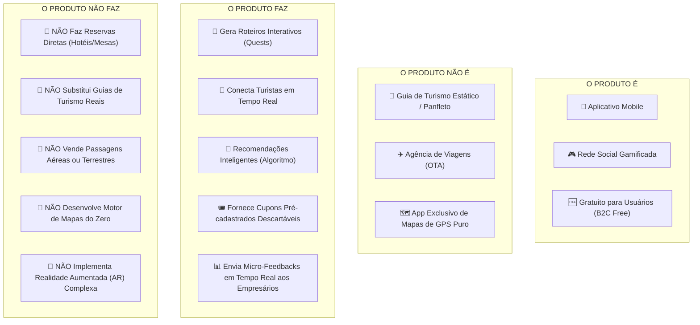

# PRD: RouteQuests (TuristAê)

## 0. Document Purpose

Este Documento de Requisitos de Produto (PRD) formaliza a especificação oficial do **RouteQuests (TuristAê)** para o fechamento da **Fase 1 (Planejamento e Requisitos)** no âmbito da disciplina **Projetos Aplicados II**. Ele sintetiza as diretrizes da Lean Inception, a matriz estratégica **É / NÃO É / FAZ / NÃO FAZ** e as mecânicas operacionais de funcionamento (origem das quests, micro-feedback em tempo real e anti-fraude de cupons), servindo como contrato canônico para as fases de Design UX (Sally), Arquitetura Técnica (Winston) e Desenvolvimento de Software (Amelia).

---

## 1. Visão do Produto e Matriz Estratégica

### 1.1 Declaração de Visão (Lean Inception)
* **Para:** Turistas em busca de experiências dinâmicas e comerciantes/empresas do setor de turismo local.
* **Cujo Problema:** A falta de engajamento, roteiros engessados, experiências turísticas genéricas e a demora do comércio local em conectar-se com o visitante durante a viagem.
* **O RouteQuests (TuristAê):** É um **aplicativo mobile de rede social gamificada**, **100% gratuito para os usuários viajantes**.
* **Que:** Transforma a jornada do viajante convertendo roteiros e preferências em **missões interativas (Quests)** com acúmulo de pontos, insígnias (*badges*) e cupons previamente cadastrados pelo comércio local.
* **Diferente de:** Guias estáticos, panfletos digitais, agências de viagem (OTAs) ou apps de mapa/GPS puro (como Google Maps ou TripAdvisor tradicional).
* **O Nosso Produto:** Conecta turistas em tempo real no destino por meio de um **algoritmo de recomendação inteligente explicável** e fornece um **painel em tempo real para os empresários locais receberem micro-feedbacks e gerenciarem cupons promocionais descartáveis**.

---

### 1.2 Matriz Estratégica: É – NÃO É – FAZ – NÃO FAZ

---

## 2. Usuários-Alvo e Contexto de Mercado

### 2.1 Jobs To Be Done (JTBD)

#### Segmento B2C — Turistas e Viajantes (Gratuito):
- **Funcional:** Descobrir pontos turísticos, roteiros culturais e gastronômicos interativos sem precisar de guias estáticos ou panfletos impressos.
- **Social:** Conectar-se com outros viajantes na mesma cidade em tempo real, compartilhando conquistas, fotos de check-ins e dicas.
- **Emocional:** Sentir a satisfação lúdica de cumprir desafios, colecionar insígnias e obter descontos reais no comércio local através dos pontos acumulados.

#### Segmento B2B — Empresários e Comércio Local:
- **Funcional:** Cadastrar cupons promocionais prévios para atrair fluxo qualificado de turistas em horários estratégicos.
- **Inteligência em Tempo Real:** Acompanhar as opiniões e notas dos turistas em tempo real pelo painel, permitindo melhoria contínua e intervenção rápida.
- **Econômico & Segurança:** Validar resgates sem risco de fraudes com cupons descartáveis de uso único.

### 2.2 Principais Jornadas de Usuário (User Journeys)

#### UJ-1: Sofia cumpre uma Quest, resgata cupom anti-fraude e envia micro-feedback
- **Persona & Contexto:** Sofia, 24 anos, turista independente explorando um centro histórico.
- **Estado de Entrada:** App mobile gratuito instalado, autenticada.
- **Fluxo:**
  1. Sofia abre o app e recebe da **Recomendação Inteligente** a missão *"Circuito do Café Histórico"*.
  2. Sofia cumpre as 3 paradas da rota com validação de check-in geolocalizado (GPS).
  3. Ao concluir, ganha a insígnia *"Exploradora do Café"* e 100 pontos XP.
  4. O app libera o resgate de um cupom de 15% em uma cafeteria histórica a 50m.
  5. Sofia clica em *"Resgatar Cupom"*; o app gera um token de uso único (`RQ-8429`) com validade de 15 minutos.
  6. O atendente da cafeteria digita `RQ-8429` no painel web e dá baixa imediata.
  7. Ao concluir a compra, o app abre um micro-feedback de 2 toques: Sofia dá 5 estrelas, clica na tag *"Atendimento Ágil"* e escreve *"Café excelente!"*.
- **Clímax:** A notificação chega em tempo real no painel do dono da cafeteria e Sofia ganha 20 XP extras.
- **Resolução:** Sofia e o empresário fecham um ciclo virtuoso de benefício mútuo.

#### UJ-2: Pedro conecta-se com outros viajantes na mesma praça
- **Persona & Contexto:** Pedro, viajante solo que quer companhia para passeios culturais.
- **Estado de Entrada:** Usuário ativo navegando pelo feed social do RouteQuests.
- **Fluxo:**
  1. Pedro visualiza no feed postagens em tempo real de turistas que acabaram de fazer check-in na mesma praça.
  2. Pedro curte a publicação, comenta e envia uma solicitação de amizade.
  3. O outro viajante aceita; ambos combinam de realizar a próxima missão de museus juntos.
- **Clímax:** O grafo social viabiliza a formação de conexões autênticas durante a viagem.
- **Resolução:** Pedro fortalece sua rede de contatos na plataforma.

#### UJ-3: Empresário acompanha opiniões e fluxo em tempo real no painel
- **Persona & Contexto:** Carlos, proprietário de um bistrô parceiro cadastrado.
- **Estado de Entrada:** Carlos acessa o Painel Web do Empresário.
- **Fluxo:**
  1. Carlos visualiza o dashboard com a contagem de turistas cumprindo missões na região.
  2. Carlos monitora o feed de micro-feedbacks recebidos em tempo real.
  3. Recebe um alerta: *"Novo cupom RQ-8429 validado com sucesso - Avaliação 5 estrelas recebida"*.
- **Clímax:** Carlos tem clareza total do retorno e do sentimento dos clientes turistas sem intermediários.

---

## 3. Glossário

- **RouteQuests (TuristAê):** Plataforma mobile gamificada de turismo inteligente.
- **Missão Interativa (Quest):** Desafio geolocalizado composto por tarefas e pontos culturais/comerciais.
- **Origem da Quest:** Classificação da missão em *Quest Oficial da Plataforma* (curadoria) ou *Quest Patrocinada* (criada por lojista parceiro).
- **Recomendação Inteligente:** Algoritmo determinístico ponderado que ranqueia missões por afinidade temática, proximidade física e popularidade.
- **Micro-Feedback em Tempo Real:** Avaliação rápida em 2 toques (estrelas + tags pré-definidas + texto curto) enviada instantaneamente ao painel do comerciante.
- **Cupom Descartável (Token Anti-Fraude):** Código dinâmico alfanumérico/QR Code de uso único com janela de expiração (15 min) que é baixado e inutilizado no painel do lojista.
- **Check-in Geolocalizado:** Validação da presença física do turista nas coordenadas do ponto via GPS (30-100m) ou QR Code físico de contingência.
- **Grafo Social:** Estrutura de relacionamentos sociais entre usuários (amizades, seguidores, curtidas, comentários e bloqueios).

---

## 4. Funcionalidades e Requisitos Funcionais (FRs)

### 4.1 Módulo 1: Algoritmo de Recomendação Inteligente e Roteiros (Quests)
**Descrição:** Motor central que calcula e entrega sugestões personalizadas de rotas, missões e conteúdos sociais. Realiza UJ-1.

#### FR-1: Onboarding e Perfil de Interesses
O sistema deve permitir que o turista selecione suas categorias de interesse (Gastronomia, História, Natureza, Aventura, Cultura, Vida Noturna) no primeiro acesso. Realiza UJ-1.
- **Critérios de Aceite:**
  - O sistema persiste de 1 a 8 categorias temáticas por perfil.
  - A alteração recalcula os pesos de recomendação imediatamente.

#### FR-2: Algoritmo de Sugestão Ponderado e Explicável
O sistema deve ranquear as missões através de uma fórmula determinística explicável baseada em:
$$\text{Score} = (\text{Afinidade de Interesses} \times 0.4) + (\text{Proximidade Física} \times 0.4) + (\text{Popularidade e Avaliação} \times 0.2)$$
- **Critérios de Aceite:**
  - Cada card de missão exibe a justificativa da sugestão (ex.: *"Porque você está a 150m e curte Gastronomia"*).
  - Raio de busca padrão de até 5km.

#### FR-3: Curadoria e Tipos de Missões (Origem das Quests)
O sistema deve suportar dois tipos de missões:
1. **Quests Oficiais da Plataforma:** Roteiros culturais pré-estruturados com descrições e desafios enriquecidos por IA.
2. **Quests Patrocinadas:** Missões pontuais cadastradas por comerciantes locais associadas a seus cupons.
- **Critérios de Aceite:**
  - Identificação visual clara do tipo de missão no feed e no mapa.

---

### 4.2 Módulo 2: Gamificação, Check-in e Economia de Pontos
**Descrição:** Mecânicas lúdicas para validação e engajamento. Realiza UJ-1.

#### FR-4: Validação de Check-in por GPS com Contingência em QR Code
O turista valida cada parada da missão ao chegar nas coordenadas geográficas do local. Realiza UJ-1.
- **Critérios de Aceite:**
  - Validação automática por GPS dentro do raio configurado (30 a 100m).
  - Botão de contingência para leitura de QR Code físico no local parceiro em caso de falha de GPS.

#### FR-5: Gestão de Pontos XP e Desbloqueio de Insígnias
Ao concluir etapas e missões, o sistema credita pontos XP e desbloqueia insígnias no perfil de forma atômica e transacional. Realiza UJ-1.
- **Critérios de Aceite:**
  - Atualização instantânea da carteira de pontos.
  - Vitrine pública de insígnias visível no perfil do viajante.

---

### 4.3 Módulo 3: Grafo Social e Conexão em Tempo Real
**Descrição:** Recursos de comunidade e rede social entre viajantes. Realiza UJ-2.

#### FR-6: Amizades, Seguidores e Feed da Comunidade
O usuário pode enviar solicitações de amizade bilaterais, seguir outros perfis e acompanhar fotos e relatos no feed local. Realiza UJ-2.
- **Critérios de Aceite:**
  - Feed social em tempo real com fotos (até 5MB) e textos vinculados às missões.

#### FR-7: Bloqueio Bidirecional de Segurança
O usuário pode bloquear outros usuários para proteger sua privacidade. Realiza UJ-2.
- **Critérios de Aceite:**
  - Cessa imediatamente visibilidade de perfil, postagens, comentários e mapa social.

---

### 4.4 Módulo 4: Painel B2B dos Empresários, Cupons Anti-Fraude e Micro-Feedback
**Descrição:** Gestão de cupons promocionais e inteligência de mercado em tempo real para os empresários locais. Realiza UJ-1, UJ-3.

#### FR-8: Emissão e Queima de Cupons Descartáveis (Anti-Fraude)
O turista pode resgatar cupons previamente cadastrados pelos lojistas utilizando seus pontos XP ou missões concluídas. Realiza UJ-1.
- **Critérios de Aceite:**
  - Ao resgatar, o app gera um código alfanumérico dinâmico (ex.: `RQ-8429`) ou QR Code com contagem regressiva de 15 minutos.
  - O comerciante digita o código no painel para validar a compra; o sistema valida e "queima" o cupom atomicamente, impedindo qualquer reutilização ou print fraudulento.

#### FR-9: Micro-Feedback em 2 Toques e Notificação em Tempo Real
Ao concluir um check-in ou resgatar um cupom, o app exibe um card de micro-avaliação ágil. Realiza UJ-1, UJ-3.
- **Critérios de Aceite:**
  - Interface composta por: Nota de 1 a 5 estrelas + Pílulas de tags rápidas (*Atendimento Ágil*, *Ambiente Agradável*, *Preço Justo*, *Demora no Atendimento*) + comentário opcional (até 140 caracteres).
  - Envio instantâneo de notificação web no Painel do Empresário informando o novo feedback.

#### FR-10: Dashboard de Desempenho do Lojista
O comerciante visualiza no painel o volume de cupons emitidos vs. validados e a média de satisfação consolidada. Realiza UJ-3.
- **Critérios de Aceite:**
  - Painel responsivo e sem necessidade de instalação de software adicional.

---

### 4.5 Módulo 5: Validação do Piloto Acadêmico (PA2)
**Descrição:** Módulo nativo para coleta empírica de resultados da disciplina. Realiza UJ-4.

#### FR-11: Módulo Nativo de Validação e Telemetria
O sistema deve disponibilizar questionário in-app para avaliação de satisfação geral (CSAT) e assertividade do piloto. Realiza UJ-4.
- **Critérios de Aceite:**
  - Exportação de dados consolidados para o relatório final da disciplina PA2.

---

## 5. Não-Objetivos Explícitos (Limites de Segurança / Anti-Alucinação)

1. **NÃO fazer reservas diretas de hotéis, mesas ou pousadas:** O app atrai o turista e entrega o cupom; a compra/atendimento é feito no balcão.
2. **NÃO substituir Guias de Turismo Reais:** O app é um facilitador de auto-guiamento autônomo, sem competir com profissionais credenciados.
3. **NÃO vender passagens aéreas ou rodoviárias:** O RouteQuests não opera como agência OTA.
4. **NÃO desenvolver motor cartográfico próprio:** Consumo de APIs maduras de mercado (Mapbox / Google Maps).
5. **NÃO implementar Realidade Aumentada (AR) pesada:** Check-in realizado via GPS e QR Code.
6. **NÃO implementar streaming de áudio/vídeo ao vivo:** Feeds focados em fotos estáticas e texto.

---

## 6. Escopo do MVP (Fase 1 / Semestral)

### 6.1 No Escopo (In-Scope v1)
- Aplicativo Mobile responsivo gratuito para turistas.
- Painel Web responsivo para empresários locais.
- Algoritmo de Recomendação Inteligente ponderado (Afinidade + Proximidade + Popularidade).
- Motor de Gamificação com Missões Oficiais e Patrocinadas, Check-in por GPS/QR Code, Pontos e Insígnias.
- Grafo Social com Amizades, Seguir, Curtir, Comentar e Bloqueio.
- Cupons descartáveis com código dinâmico de 15 minutos e baixa atômica no painel.
- Micro-Feedback em 2 toques com alerta em tempo real para os lojistas.
- Módulo nativo de validação semestral para a disciplina PA2.

### 6.2 Fora de Escopo do MVP (Out-of-Scope v1)
- Venda de passagens ou reservas diretas.
- Gateway de pagamento complexo no app (pagamento no balcão).
- Chat privado síncrono (DMs).

---

## 7. Requisitos Não-Funcionais (NFRs) e Restrições Técnicas

- **NFR-1 (Latência do Feed e Painel):** Carregamento do feed < 2,0s em 4G; notificação de feedback no painel < 3s.
- **NFR-2 (Segurança de Cupons):** Transações atômicas com locks no banco de dados para garantir que um token descartável nunca seja validado mais de uma vez.
- **NFR-3 (Privacidade e LGPD):** Coordenadas do turista utilizadas apenas para validação de check-in e cálculo de distância, sem rastreamento contínuo em background.
- **NFR-4 (Consumo de Bateria):** Amostragem de GPS sob demanda apenas ao abrir o mapa ou solicitar check-in.

---

## 8. Métricas de Sucesso e Contra-Métricas

### Métricas Primárias de Validação
- **SM-1 (Assertividade de Missões):** > 70% das missões iniciadas pelos turistas piloto concluídas com sucesso.
- **SM-2 (Ativação de Cupons no Comércio):** > 25% dos cupons gerados resgatados no balcão parceiro.
- **SM-3 (Satisfação dos Empresários com as Opiniões):** > 80% dos empresários avaliam o painel de micro-feedbacks como de alto valor.
- **SM-4 (Satisfação Geral PA2):** Índice CSAT > 85% na pesquisa de encerramento do piloto.

### Contra-Métricas (Anti-Metas)
- **SM-C1 (Equilíbrio de Cupons):** Máximo de 20% de cards patrocinados no feed.
- **SM-C2 (Taxa de Bloqueios/Spam):** Denúncias mantidas abaixo de 1% do total de postagens.

---

## 9. Perguntas Abertas e Horizontes Futuros

1. **Definição da Micro-Região do Piloto:** Escolha do bairro histórico, polo gastronômico ou campus universitário para cadastrar as 5 primeiras Quests Oficiais.
2. **Integração com Guias Locais (v2):** Permitir que guias credenciados publiquem Quests autorais e monetizem via gorjetas/patrocínios.
3. **Notificações Push Georreferenciadas:** Alertas discretos ao aproximar-se de um ponto de missão de alto interesse.

---

## 10. Índice de Premissas (Assumptions Index)

- `[ASSUMPTION-1]`: A gratuidade para o turista combinada com o cupom descartável gera tração e adesão instantânea no piloto.
- `[ASSUMPTION-2]`: O micro-feedback em 2 toques alcançará taxa de resposta superior a 60% por não exigir digitação longa.
- `[ASSUMPTION-3]`: A queima de tokens de 15 minutos no painel web do comerciante resolve 100% dos riscos de fraude de cupons.
